# OMS E2E Use Case Sequence Diagrams

This document contains one Mermaid sequence diagram per end-to-end use case defined in `cypress/e2e/`. Each diagram title matches the Cypress `describe()` label exactly. Actors are consistent across all diagrams: `Customer` (end customer), `GW` (CFW Gateway), `OMS` (Sprint Connect OMS), `WMS` (Warehouse System), `TMS` (Transport System), `POS` (Point of Sale), `STS` (Settlement Tax System). All monetary values are in satang (smallest THB unit).

---

## UC1 — Web / CMG / Prepaid full order flow

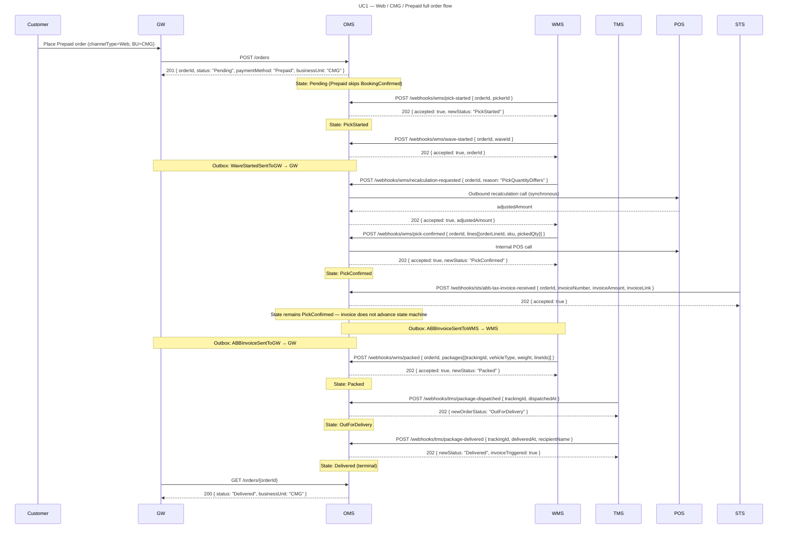

---

## UC2 — Web / CFR / Prepaid full order flow

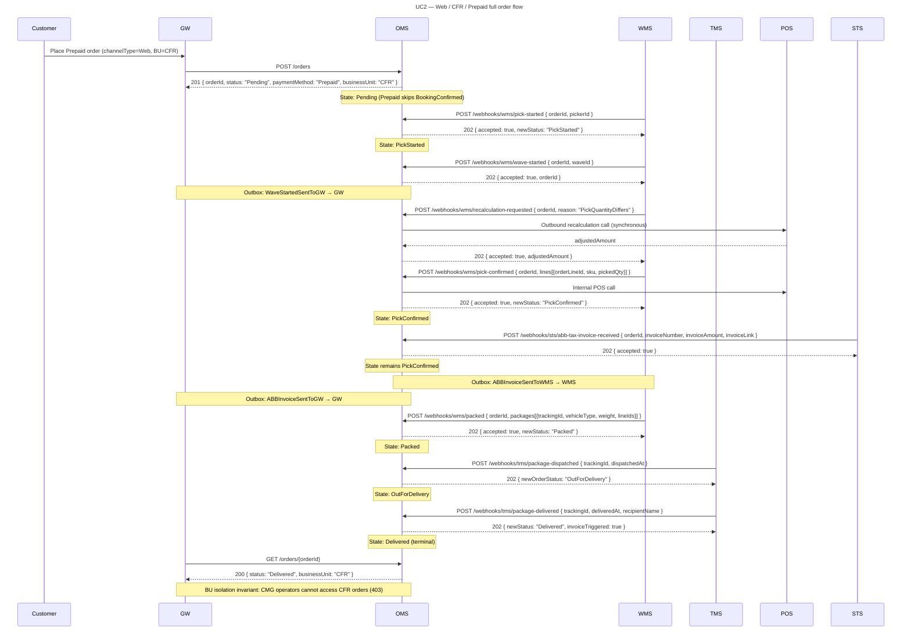

---

## UC3 — TikTok Marketplace / CMG / Prepaid — AWB retrieval after OutForDelivery

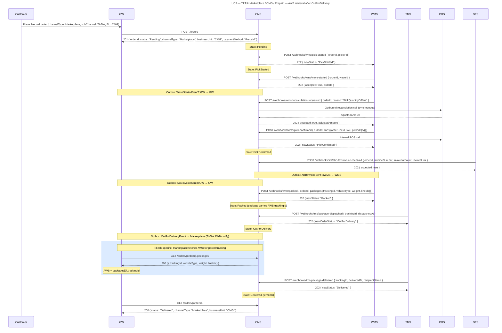

---

## UC4 — Web / CFR / POD full order flow

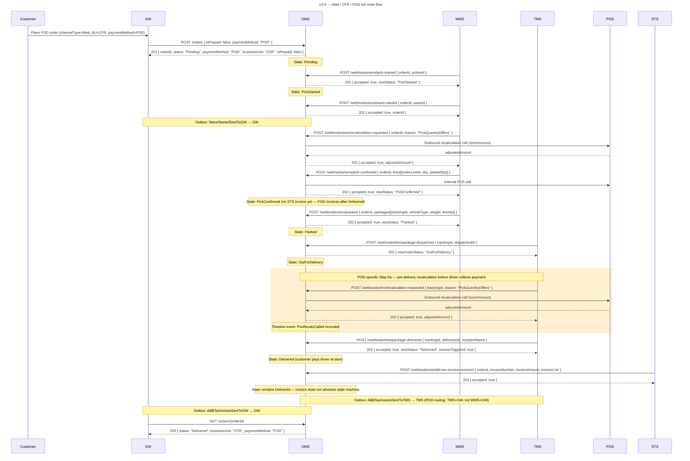

---

## UC5 — Web / CFR / POD — weight-based fresh products (pork 841.23 g + duck 1.23 kg)

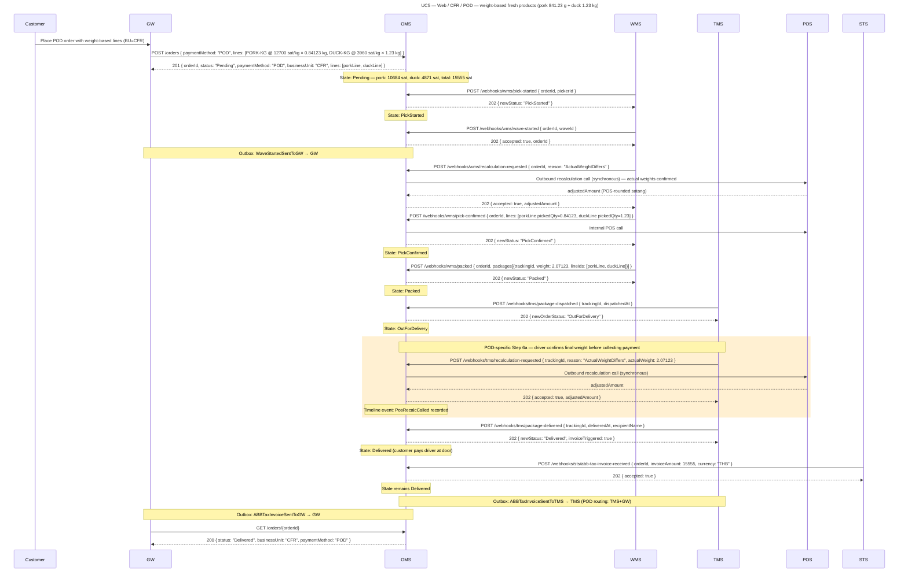

---

## UC6 — Web / CFR / POD — beef + chicken order, beef not fresh → partial return

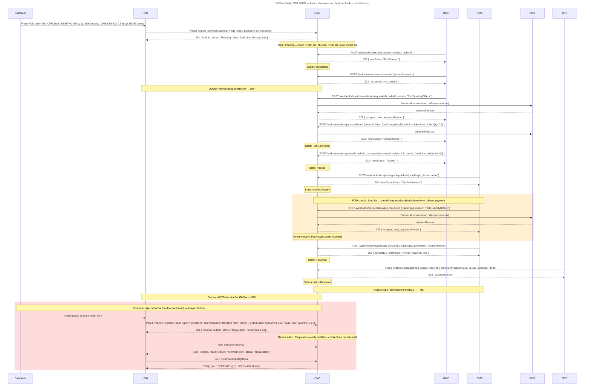

---

## UC7 — Stock transfer from Store A to Store B

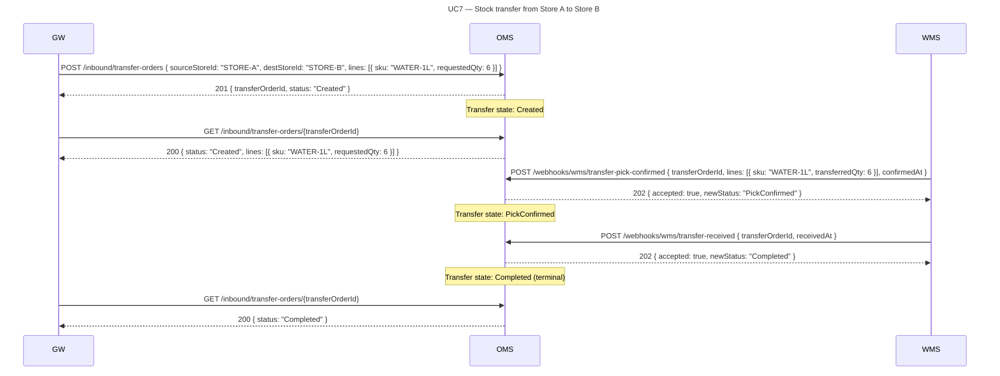

---

## UC8 — Customer postpones delivery date

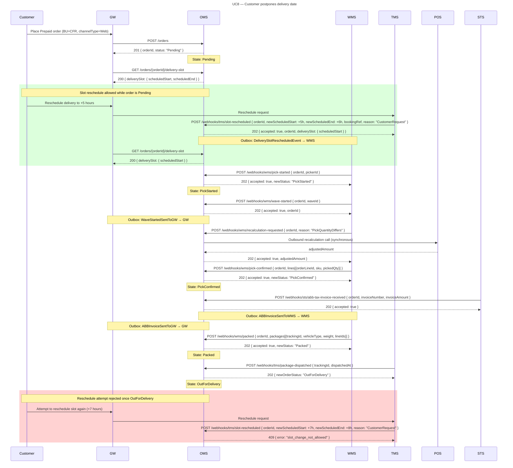

---

## UC9 — Customer cancels order

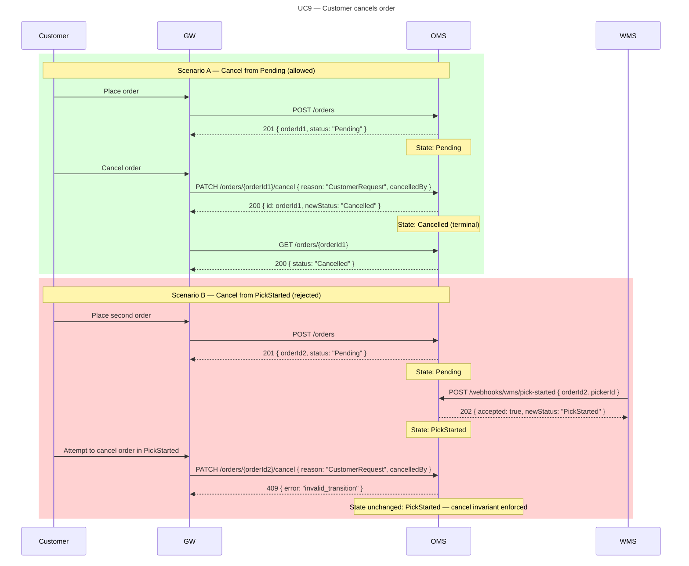

---

## UC10 — Short-pick: dish soap out of stock, only water delivered

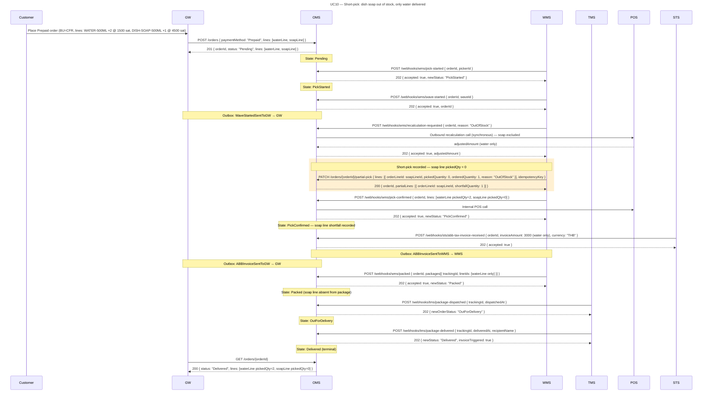

---

## UC11 — Substitution: fabric softener → dish soap, credit note for price difference

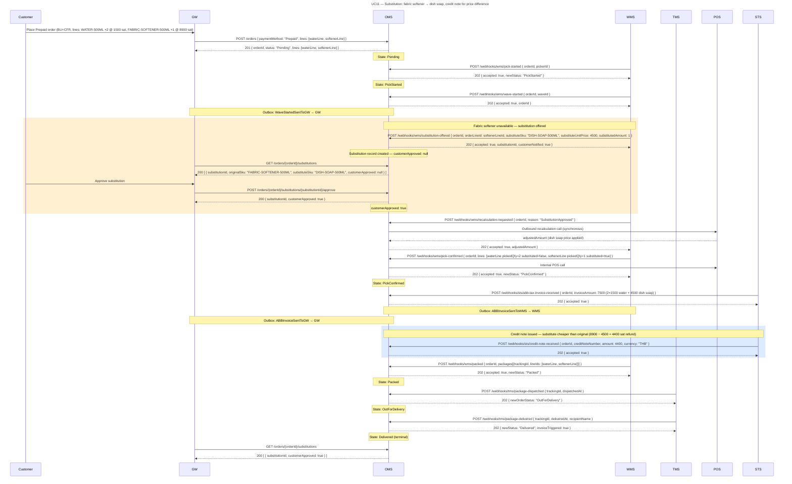

---

## UC12 — Full return after delivery (CustomerRequest)

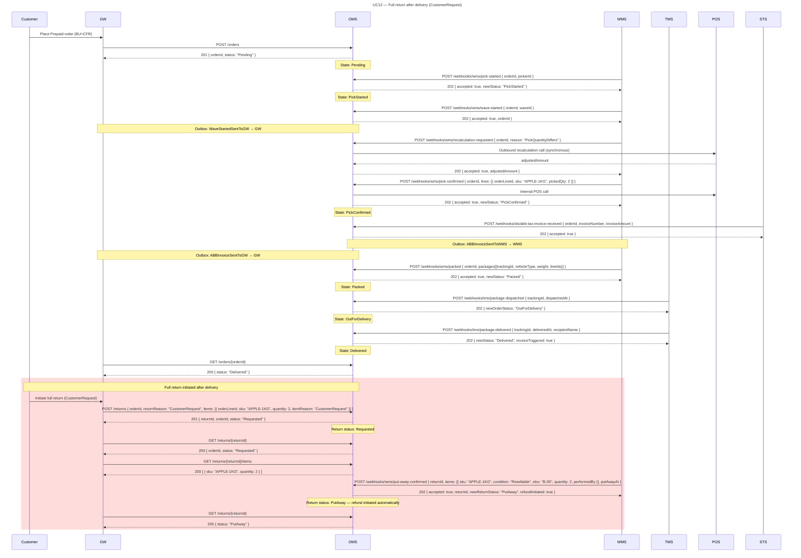

---

## UC13 — Web / CFR / Prepaid order with coupon FRESH10 (10% discount)

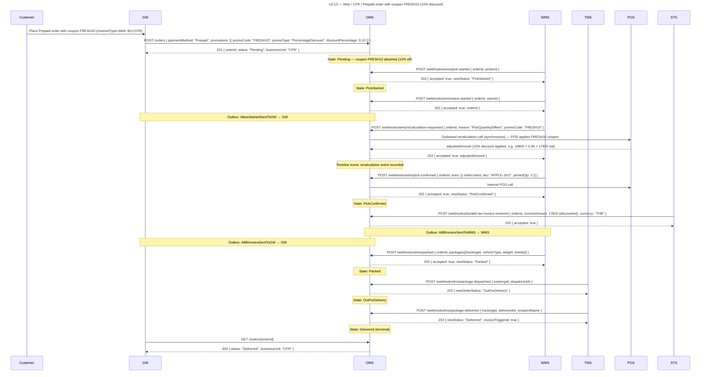

---

## Summary Table

| UC | Title | Channel | BU | Payment | Terminal State |
|----|-------|---------|-----|---------|----------------|
| UC1 | Web / CMG / Prepaid full order flow | Web | CMG | Prepaid | Delivered |
| UC2 | Web / CFR / Prepaid full order flow | Web | CFR | Prepaid | Delivered |
| UC3 | TikTok Marketplace / CMG / Prepaid — AWB retrieval after OutForDelivery | Marketplace (TikTok) | CMG | Prepaid | Delivered |
| UC4 | Web / CFR / POD full order flow | Web | CFR | POD | Delivered |
| UC5 | Web / CFR / POD — weight-based fresh products (pork 841.23 g + duck 1.23 kg) | Web | CFR | POD | Delivered |
| UC6 | Web / CFR / POD — beef + chicken order, beef not fresh → partial return | Web | CFR | POD | Delivered + ReturnRequested |
| UC7 | Stock transfer from Store A to Store B | — (Inbound) | — | — | Completed |
| UC8 | Customer postpones delivery date | Web | CFR | Prepaid | OutForDelivery (slot-reschedule 409 enforced) |
| UC9 | Customer cancels order | Web | — | — | Cancelled (Scenario A) / PickStarted—unchanged (Scenario B) |
| UC10 | Short-pick: dish soap out of stock, only water delivered | Web | CFR | Prepaid | Delivered |
| UC11 | Substitution: fabric softener → dish soap, credit note for price difference | Web | CFR | Prepaid | Delivered |
| UC12 | Full return after delivery (CustomerRequest) | Web | CFR | Prepaid | Delivered + PutAway (return) |
| UC13 | Web / CFR / Prepaid order with coupon FRESH10 (10% discount) | Web | CFR | Prepaid | Delivered |
