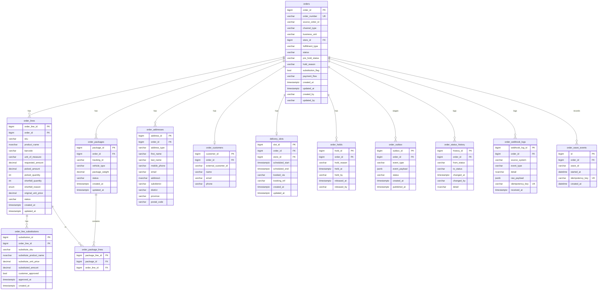
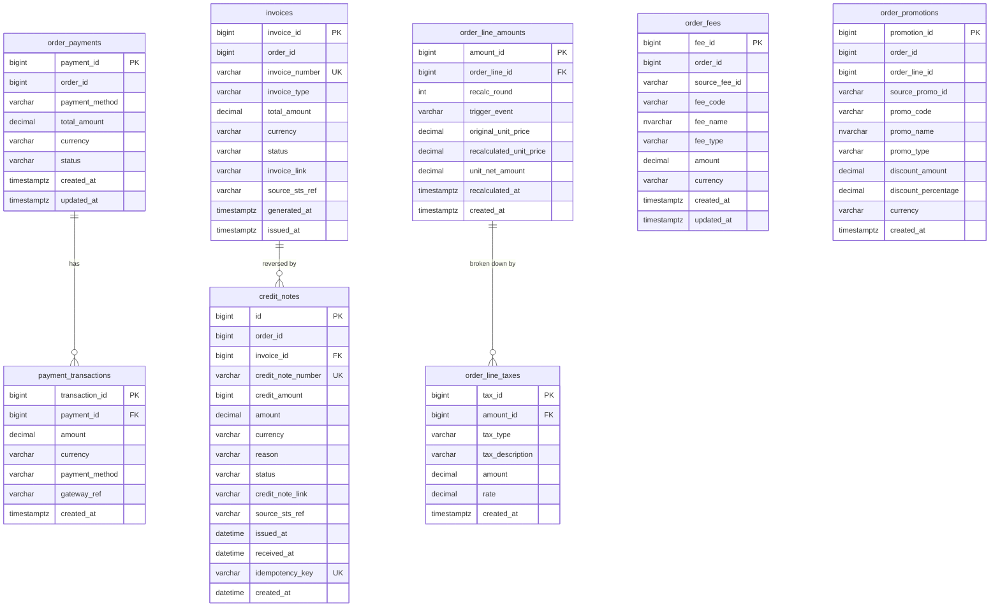
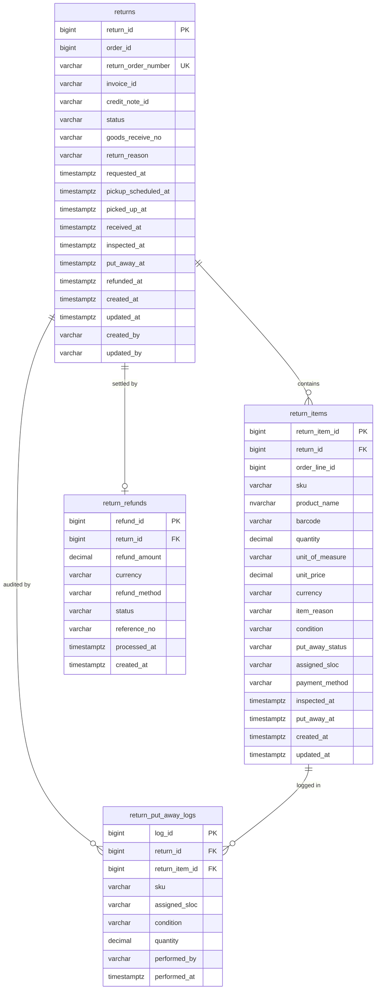
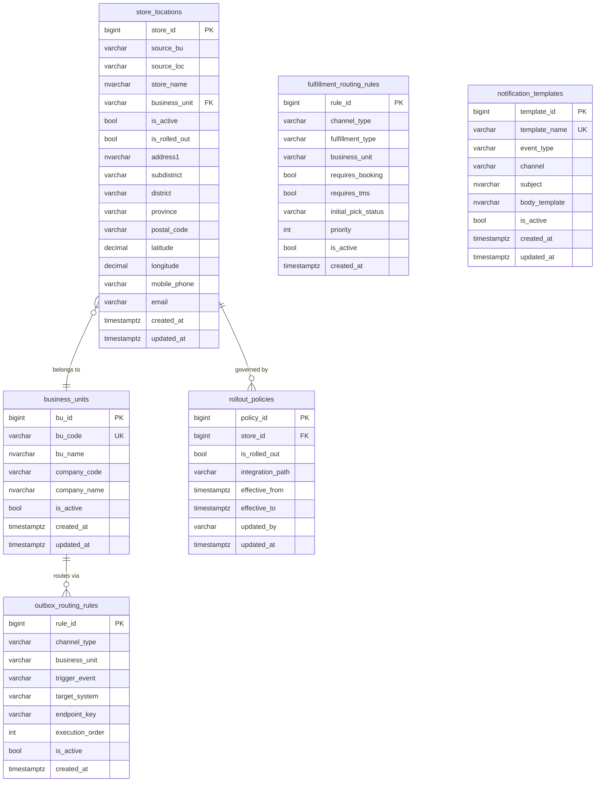
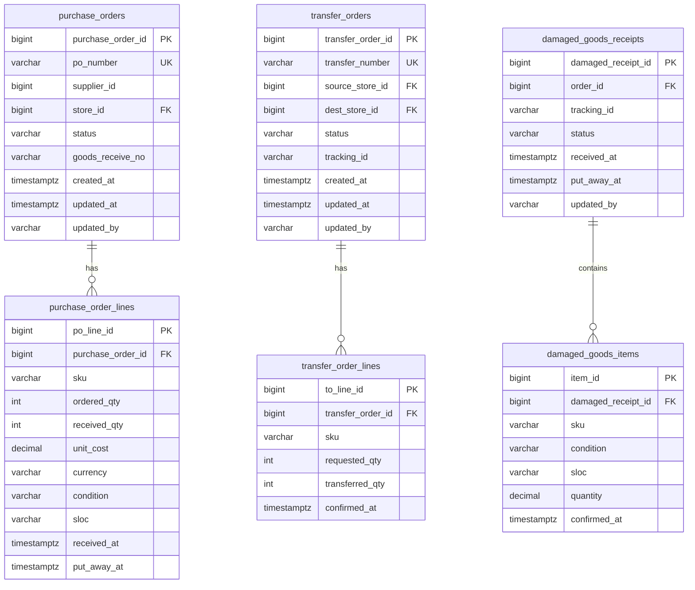

# Sprint Connect OMS — ER Diagrams

**Version:** 2.0  
**Architecture:** Modular Monolith — 5 bounded contexts, each owning its own MySQL schema.

---

## Module 1 — Order (schema: `orders`)

Core aggregate. Owns the order lifecycle state machine, delivery slots, packages, outbox, and all audit logs.

> `payment_flow` on the `orders` entity drives STS outbox routing. `PRE_PAID` orders forward the ABB/Tax Invoice to WMS + Gateway after `PickConfirmed`; `PAY_ON_DELIVERY` orders forward it to TMS + Gateway after the `Delivered` event. Credit notes follow the same split. No new tables are required for POD — routing is handled by existing `config.outbox_routing_rules` rows keyed on `(trigger_event, payment_flow)` for each POD outbox event.

---

## Module 2 — Payment (schema: `payment`)

Tracks all financial records per order: invoices, credit notes, recalculated line amounts, taxes, fees, and promotions.

---

## Module 3 — Returns (schema: `returns`)

Tracks customer return requests from initiation through inspection, put-away, and refund.

---

## Module 4 — Configuration (schema: `config`)

Master data and business rules referenced by all other modules.

---

## Module 5 — Inbound (schema: `inbound`)

Goods arriving at the warehouse from suppliers (POs), from other stores (Transfer Orders), or damaged packages returned by drivers.

---

## Cross-Module References

| From module | Column | To module | References |
|---|---|---|---|
| `orders.orders` | `store_id` | `config` | `store_locations.store_id` |
| `orders.delivery_slots` | `store_id` | `config` | `store_locations.store_id` |
| `inbound.purchase_orders` | `store_id` | `config` | `store_locations.store_id` |
| `inbound.transfer_orders` | `source_store_id` | `config` | `store_locations.store_id` |
| `inbound.transfer_orders` | `dest_store_id` | `config` | `store_locations.store_id` |
| `returns.returns` | `order_id` | `orders` | `orders.order_id` |
| `returns.return_items` | `order_line_id` | `orders` | `order_lines.order_line_id` |
| `payment.invoices` | `order_id` | `orders` | `orders.order_id` |
| `payment.order_line_amounts` | `order_line_id` | `orders` | `order_lines.order_line_id` |
| `inbound.damaged_goods_receipts` | `order_id` | `orders` | `orders.order_id` |
| `orders.order_wave_events` | `order_id` | `orders` | `orders.order_id` |
| `payment.credit_notes` | `order_id` | `orders` | `orders.order_id` |

> Cross-module references are enforced at the application layer (not as foreign key constraints across schemas) to preserve bounded context isolation.

---

## Architecture Decision: Modular Monolith

| Criterion | Chosen Approach |
|---|---|
| Deployment | Single deployable unit (modular monolith) |
| Schema isolation | Each context owns one MySQL schema; no cross-schema JOINs |
| Event propagation | Outbox pattern — events are staged in `orders.order_outbox` and dispatched asynchronously |
| Cross-module consistency | Eventual consistency via outbox; no distributed transactions |
| Future migration path | Each module can be extracted to a microservice independently |
