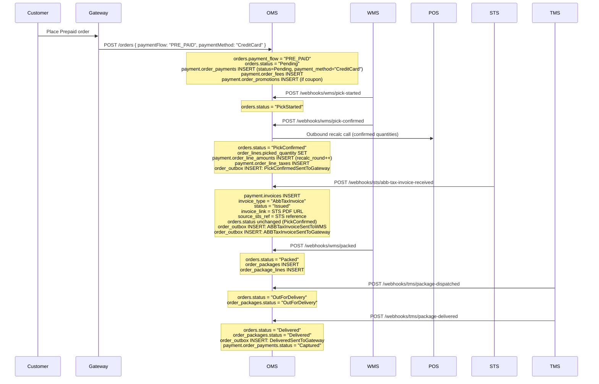
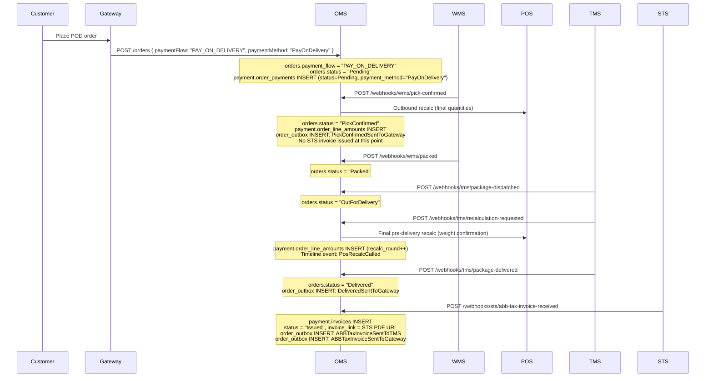
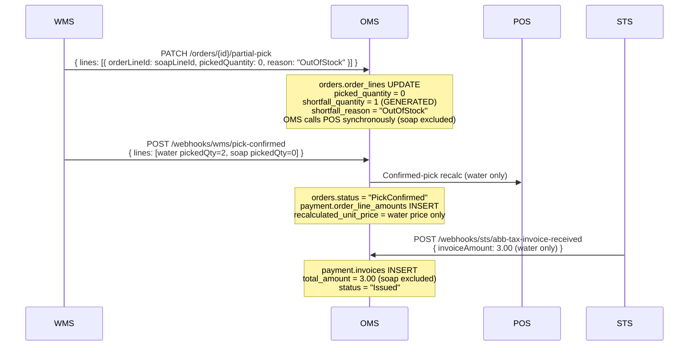
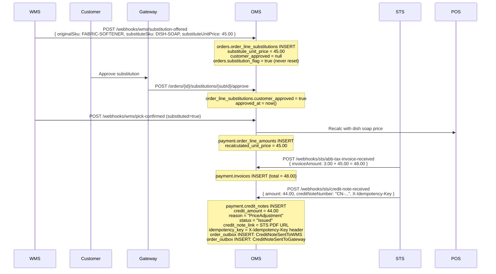
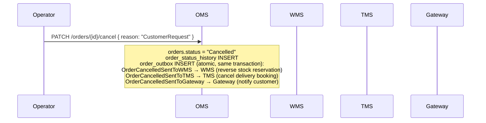
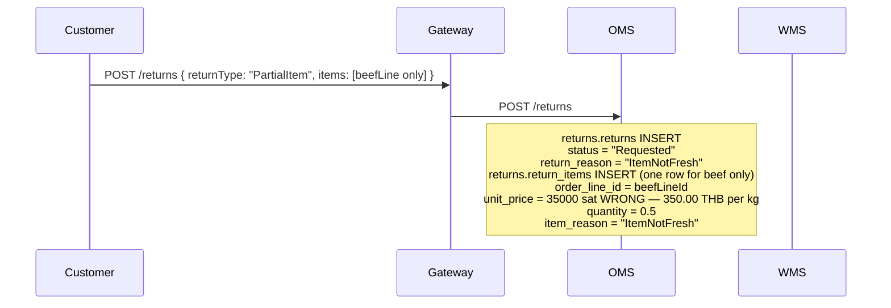
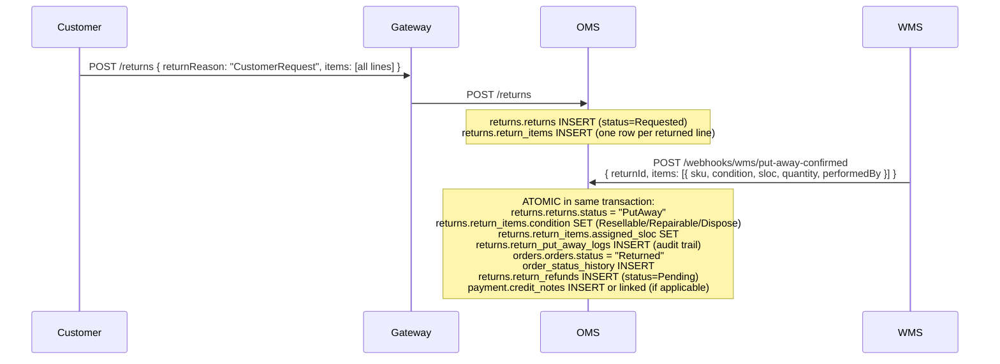

# Sprint Connect OMS — Payment Processing Reference

**Version:** 1.0  
**Date:** 2026-05-19  
**Scope:** All payment flows in the `payment.*` schema and the `returns.*` schema, plus STS/outbox routing

---

## 1. Purpose

This document is the authoritative team reference for every payment-related flow in the OMS. It answers:

- When is an invoice issued, and to whom is it forwarded?
- What database records are written at each step?
- What happens to money when an order is short-picked, a substitution is made, an order is cancelled, or a customer returns items?
- How is payment-event routing kept out of application code and driven purely by configuration?
- How are all gateway calls made idempotent?

Read this document before touching anything in `payment.*`, `returns.*`, `orders.order_outbox`, or `config.outbox_routing_rules`.

---

## 2. Core Concepts

### 2.1 Payment Flow Types

The `orders.payment_flow` column (VARCHAR 50) controls the entire payment lifecycle. There are two values:

| `payment_flow` | Invoice trigger | Invoice forwarded to |
|---|---|---|
| `"PRE_PAID"` | `PickConfirmed` event | WMS + Gateway |
| `"PAY_ON_DELIVERY"` | `Delivered` event | TMS + Gateway |

The payment instrument (e.g. `CreditCard`, `QRCode`, `PayOnDelivery`) is stored separately in `payment.order_payments.payment_method` and is not used for routing.

**Why the distinction matters for the whole team:**

- A Prepaid customer has already paid at checkout. The invoice and any credit note must reach WMS (so the picker knows what is going out) and Gateway (for the customer's receipt) before the package leaves the warehouse.
- A POD/COD customer pays the driver at the door. No invoice exists until the moment of delivery. TMS (not WMS) gets the invoice because the driver is the collection agent.

### 2.2 The Settlement & Tax System (STS)

STS is an external system that generates official ABB/Tax Invoice documents. OMS never generates invoices itself — it receives them from STS via inbound webhooks and stores and forwards them. The trigger chain is:

```
OMS state change
    → outbox event to Gateway
        → Gateway processes payment externally
            → STS sends invoice/credit note webhook to OMS
                → OMS stores in payment.invoices / payment.credit_notes
                    → OMS dispatches outbox events to downstream systems
```

STS webhooks always carry `X-Idempotency-Key`. Duplicate keys are detected against `payment.credit_notes.idempotency_key` (unique constraint) and `orders.order_webhook_logs.idempotency_key` (unique constraint). A duplicate request returns `409 conflict` and is not reprocessed.

### 2.3 Payment Schema Tables

| Table | Purpose | Key columns |
|---|---|---|
| `payment.order_payments` | Top-level payment record per order | `payment_id`, `order_id`, `payment_method`, `total_amount`, `status` (Pending / Authorised / Captured / Refunded / Failed) |
| `payment.payment_transactions` | One row per **inbound payment** gateway call (auth, capture only — never refund) | `transaction_id`, `payment_id`, `amount`, `gateway_ref` |
| `payment.invoices` | ABB/Tax Invoice documents received from STS | `invoice_id`, `order_id`, `invoice_number`, `invoice_type`, `total_amount`, `status` (Generated / Issued / Voided), `invoice_link`, `source_sts_ref`, `generated_at`, `issued_at` |
| `payment.credit_notes` | Credit note documents from STS and internal reversals | `id`, `order_id`, `invoice_id`, `credit_note_number`, `credit_amount`, `reason`, `status` (Issued / Applied / Cancelled), `credit_note_link`, `source_sts_ref`, `idempotency_key` |
| `payment.order_line_amounts` | Recalculated price per line per POS round | `amount_id`, `order_line_id`, `recalc_round`, `trigger_event`, `recalculated_unit_price`, `unit_net_amount` |
| `payment.order_line_taxes` | Tax breakdown per amount record | `tax_id`, `amount_id`, `tax_type` (VAT / ExciseTax / WithholdingTax), `amount`, `rate` |
| `payment.order_fees` | Delivery, service, and platform fees | `fee_id`, `order_id`, `fee_code`, `fee_type`, `amount` |
| `payment.order_promotions` | Discounts applied to lines or the whole order | `promotion_id`, `order_id`, `order_line_id`, `promo_code`, `promo_type`, `discount_amount` |

Refund records live in the `returns` schema:

| Table | Purpose | Key columns |
|---|---|---|
| `returns.return_refunds` | Money-back record for a return | `refund_id`, `return_id`, `refund_amount`, `refund_method`, `status` (Pending / Processed / Failed), `reference_no`, `processed_at` |

### 2.4 Row counts per order — `order_payments` vs `payment_transactions`

`order_payments` is always **1 row per order**. `payment_transactions` is **1 or more rows** — one per gateway call on the collecting-money side only. Refunds (return or cancellation) are **never** written to `payment_transactions`; they live in `returns.return_refunds`.

| Flow | `order_payments` rows | `payment_transactions` rows |
|---|---|---|
| Normal Prepaid — delivered, no return | 1 | 2 — auth + capture |
| Prepaid — full return after delivery | 1 | 2 — auth + capture (refund goes to `returns.return_refunds`, not here) |
| Prepaid — failed first auth, retry succeeds | 1 | 3 — failed auth + retry auth + capture |
| POD / COD — pay on delivery | 1 | 1 — capture only (no pre-auth) |
| Cancelled before capture | 1 | 1 — auth only (cancellation refund handled by Gateway, no OMS callback) |

### 2.4 Monetary Value Rules

- All amounts are stored as `decimal` in **baht (THB)** — never satang, never float.
- `payment.order_payments.total_amount` — the **pre-discount** requested total written at order creation. This is not the final invoiced amount — the final discounted total is derived from `payment.order_line_amounts` after POS recalculation.
- `payment.order_line_amounts.recalculated_unit_price` — the **post-discount** price per unit per line, written at `PickConfirmed` after POS applies any promotions. This is the authoritative figure used by STS to generate the invoice.
- `payment.credit_notes.credit_amount` — the baht amount credited back. Use this column for calculations; `credit_notes.amount` is a legacy alias.
- `returns.return_items.unit_price` — the original price per unit from the order, used to compute the refund.
- `returns.return_refunds.refund_amount` — total baht to return to the customer.

---

### 2.5 `payment_transactions` Lifecycle

`payment_transactions` has **one row per gateway call**. Rows are written by **Gateway**, not by OMS — OMS never calls `INSERT` into this table during its own order lifecycle handlers. Gateway writes the row and OMS reads it for display (e.g. `GET /orders/{id}/payment`).

**`PaymentTransactionDto` has no `transaction_type` column.** The transaction type is inferred from the `gateway_ref` prefix:

| `gateway_ref` prefix | Meaning | When it appears |
|---|---|---|
| `Gateway-AUTH-*` | Pre-authorisation | Gateway pre-authorises the card when the customer places a Prepaid order at checkout |
| `Gateway-CAP-*` | Capture | Gateway captures funds — for Prepaid after `PickConfirmed`; for POD/COD after `Delivered` |
| `Gateway-REF-*` | Refund | Gateway processes a refund — see note below |

**Important — refunds and `payment_transactions`:** OMS does **not** write a `payment_transactions` row when it processes a return. The refund record in OMS is `returns.return_refunds`, written atomically at put-away confirmation. The refund amount OMS calculated and submitted is **fully visible** via `GET /returns/{id}/refund`, which returns both `returns.return_refunds` and the linked `payment.credit_notes` record:

| Field | Table | What it shows |
|---|---|---|
| `refund_amount` | `returns.return_refunds` | Total THB to refund — `SUM(quantity × unit_price)` across all return items |
| `refund_method` | `returns.return_refunds` | How the money is returned (`CreditCard`, `BankTransfer`, `StoreCredit`) |
| `status` | `returns.return_refunds` | `Pending` / `Processed` / `Failed` |
| `reference_no` | `returns.return_refunds` | Gateway transaction reference once submitted |
| `credit_amount` | `payment.credit_notes` | STS credit note amount |
| `credit_note_link` | `payment.credit_notes` | PDF link to the official credit note document |

What OMS **cannot** show is whether the money actually reached the customer's bank — there is no inbound callback webhook from Gateway confirming the transfer outcome. The gap is **outcome confirmation only**, not the refund amount itself.

**`payment.order_payments.status` lifecycle** (updated by Gateway, not by OMS handlers):

| Status | Meaning |
|---|---|
| `Pending` | Order placed, no payment action yet |
| `Authorised` | Card pre-authorised at checkout (Prepaid) |
| `Captured` | Funds captured — final confirmation of payment |
| `Refunded` | Full refund processed by Gateway |
| `Failed` | Payment action failed |

---

## 3. POS Recalculation and the Price Record

Before an invoice can be issued, OMS must know the final price. POS (Point of Sale) is the system of record for pricing. OMS calls POS outbound (synchronously) whenever actual quantities or products differ from what was ordered.

**When OMS calls POS:**

1. WMS sends `POST /webhooks/wms/recalculation-requested` — OMS calls POS synchronously, receives `adjustedAmount`.
2. WMS sends `POST /webhooks/wms/pick-confirmed` — OMS calls POS again with the final confirmed quantities.
3. TMS sends `POST /webhooks/tms/recalculation-requested` (POD only, at the door) — OMS calls POS for a final pre-payment confirmation of weight-based items.
4. A substitution is approved — OMS calls POS with the substitute SKU price.

**Database record created for each round:**

```
payment.order_line_amounts
  order_line_id  → references orders.order_lines.order_line_id
  recalc_round   → increments each time POS is called (1, 2, 3 ...)
  trigger_event  → "PickConfirmed" | "SubstitutionApproved" | "ManualTrigger"
  recalculated_unit_price
  unit_net_amount
  recalculated_at

payment.order_line_taxes    (one row per tax component per round)
  amount_id      → references order_line_amounts.amount_id
  tax_type       → "VAT" | "ExciseTax" | "WithholdingTax"
  rate
  amount
```

Promotions are written atomically with the order at creation and serve as **input to POS recalculation** — they do not directly modify `order_payments.total_amount`. The discounted price is only materialised in `order_line_amounts` after POS processes the confirmed quantities at `PickConfirmed`.

```
payment.order_promotions
  order_id, order_line_id (null = order-level discount)
  promo_code, promo_type  → "PercentageDiscount" | "FixedDiscount" | "BuyXGetY" | "FreeGift"
  discount_amount
  source_promo_id         → POS promotion control ID sent to POS in CTLID field
```

**Promotion data flow — order of writes:**

| Step | Table | What is written |
|---|---|---|
| `POST /orders` | `payment.order_payments` | `total_amount` = pre-discount requested total |
| `POST /orders` | `payment.order_promotions` | `promo_code`, `promo_type`, `discount_amount` (input for POS) |
| `PickConfirmed` | `payment.order_line_amounts` | `recalculated_unit_price` = price after discount applied by POS |
| `PickConfirmed` | `payment.order_line_taxes` | VAT calculated on the discounted price |
| STS invoice received | `payment.invoices` | `total_amount` = final discounted total from STS |

> **Note:** The flow above is fully documented for `PercentageDiscount` and `FixedDiscount` only. See open questions below for `BuyXGetY` and `FreeGift`.

---

### Open Questions — `BuyXGetY` and `FreeGift` promotions

The following questions must be answered by the Gateway/POS team before implementing these promotion types. Nothing below is decided — these are unknowns.

**Q1 — How does the free item appear in `POST /orders`?**

Three possible approaches, each with different implications for `orders.order_lines` and `payment.order_promotions`:

| Approach | order_lines at creation | order_promotions | Impact |
|---|---|---|---|
| A — Same line, averaged price | 3 units on one line at full unit price | `BuyXGetY`, `discount_amount` = 1 unit price | POS averages cost across all units in recalc |
| B — Same line, one unit at zero | 3 units on one line at full unit price | `BuyXGetY`, `discount_amount` = 1 unit price | POS sets `recalculated_unit_price = 0` for the free unit in `order_line_amounts` |
| C — Separate free item line | 2 paid lines + 1 free line in the request | `BuyXGetY` linked to the free `order_line_id` | Free line has `original_unit_price = 0` from Gateway |

**Q2 — What does `order_payments.total_amount` contain at creation?**

- Full price of all units (before the free item is deducted)?
- Net price already excluding the free unit?

**Q3 — Does `discount_amount` on `order_promotions` represent the unit price of the free item, or zero?**

For `PercentageDiscount` and `FixedDiscount`, `discount_amount` is the baht value deducted. For `BuyXGetY`, it is unclear whether this field holds the value of the free item, or whether the discount is expressed purely through POS recalculation with no value stored here.

**Q4 — Does `FreeGift` follow the same pattern as `BuyXGetY`, or is it always a separate order line with `original_unit_price = 0`?**

**Owner:** Gateway team + POS team  
**Required before:** implementing `BuyXGetY` / `FreeGift` in order creation or POS recalculation handlers

---

## 4. Use Cases — Payment Processing Steps

### UC-A: Prepaid Order — Normal Full-Pick Flow (UC1, UC2, UC13)

This is the baseline Prepaid flow. Every step is in sequence with the order state machine.



**Payment database writes — step by step:**

| Step | Table | Operation | Key values written |
|---|---|---|---|
| Order created | `payment.order_payments` | INSERT | `status = Pending`, `total_amount` = **pre-discount** requested total, `payment_method` = instrument from request (e.g. `CreditCard`, `QRCode`) |
| Order created | `payment.order_fees` | INSERT (if fees exist) | `fee_code`, `amount` |
| Order created | `payment.order_promotions` | INSERT (if promotions exist) | `promo_code`, `discount_amount` — input to POS only, does not update `total_amount` |
| PickConfirmed | `payment.order_line_amounts` | INSERT per line | `recalc_round = 1`, `trigger_event = PickConfirmed`, `recalculated_unit_price` |
| PickConfirmed | `payment.order_line_taxes` | INSERT per tax component | `tax_type`, `rate`, `amount` |
| STS invoice received | `payment.invoices` | INSERT | `invoice_number`, `invoice_type = AbbTaxInvoice`, `status = Issued`, `invoice_link`, `source_sts_ref`, `generated_at` = STS `issuedAt` |
| Delivered | `payment.order_payments` | UPDATE | `status = Captured` |

**For UC13 (coupon FRESH10):** POS applies the `PercentageDiscount` (10%) during the recalculation. The `payment.order_line_amounts.recalculated_unit_price` reflects the discounted price (e.g. 198.00 × 0.90 = 178.20). The STS ABB/Tax Invoice `total_amount` is the discounted figure.

---

### UC-B: POD/COD Order — Normal Full-Pick Flow (UC4, UC5)

The POD flow runs identically to Prepaid through `PickConfirmed`. The difference begins after `PickConfirmed` — no STS invoice arrives until after `Delivered`.



**Key differences from Prepaid:**

| Aspect | Prepaid | POD / COD |
|---|---|---|
| `orders.payment_flow` | `"PRE_PAID"` | `"PAY_ON_DELIVERY"` |
| Invoice trigger | `PickConfirmed` | `Delivered` |
| Pre-delivery TMS recalc | No | Yes — `POST /webhooks/tms/recalculation-requested` |
| Invoice forwarded to | WMS + Gateway | TMS + Gateway |
| Credit note forwarded to | WMS + Gateway | TMS + Gateway |

For UC5 (weight-based items like pork/duck): the pre-delivery TMS recalculation at the door confirms the exact final weight and price. `payment.order_line_amounts` gets a new row for each weight-confirmed line. The STS invoice `total_amount` reflects the final weighed price (e.g. pork 106.84 + duck 48.71 = 155.55 THB).

---

### UC-C: Partial Pick — Shortfall on One or More Lines (UC10)

When WMS cannot pick all requested items, the picker records a partial pick. Only items actually picked are billed.

**Example:** order for WATER-500ML ×2 and DISH-SOAP-500ML ×1. Soap is out of stock.



**Database writes for the short-picked line:**

| Column | Value |
|---|---|
| `orders.order_lines.picked_quantity` | 0 |
| `orders.order_lines.shortfall_quantity` | 1 (GENERATED: `ordered_quantity - picked_quantity`) |
| `orders.order_lines.shortfall_reason` | `OutOfStock` |
| `payment.invoices.total_amount` | Reflects picked items only — soap is excluded |

The customer is only charged for what was delivered. No credit note is needed; the invoice itself reflects the reduced amount. STS issues the invoice against the confirmed quantity, not the original ordered quantity.

**Guard invariant:** `PATCH /orders/{id}/partial-pick` returns `422 zero_pick_not_allowed` if all lines would reach zero. The order must be cancelled instead.

---

### UC-D: Customer Substitution Rejection — Voided Line, Credit Note (UC11)

When WMS cannot find an item and proposes a substitute, the customer may accept or reject. If the customer **accepts** and the substitute is cheaper, STS issues a credit note for the price difference.

**Example:** fabric softener (89.00 THB) substituted with dish soap (45.00 THB). Difference = 44.00 THB credit note.



**All writes for the substitution credit-note scenario:**

| Table | Column | Value |
|---|---|---|
| `orders.order_line_substitutions` | `substitute_sku` | `DISH-SOAP-500ML` |
| `orders.order_line_substitutions` | `substitute_unit_price` | `45.00` |
| `orders.order_line_substitutions` | `customer_approved` | `true` |
| `orders.order_line_substitutions` | `approved_at` | timestamp |
| `payment.order_line_amounts` | `recalculated_unit_price` | `45.00` |
| `payment.invoices` | `total_amount` | `48.00` (water + soap) |
| `payment.credit_notes` | `credit_amount` | `44.00` |
| `payment.credit_notes` | `reason` | `PriceAdjustment` |
| `payment.credit_notes` | `status` | `Issued` |
| `payment.credit_notes` | `idempotency_key` | UUID from `X-Idempotency-Key` header |

**If the customer rejects the substitution** instead of approving it:

- `order_line_substitutions.customer_approved = false`
- The original order line: `orders.order_lines.status = "Voided"`
- The voided line is excluded from all subsequent POS recalculations and from the STS invoice.
- OMS responds to `POST /orders/{id}/substitutions/{subId}/reject` with `{ customerApproved: false }`.

---

### UC-E: Order Cancellation (UC9)

Cancellation is only allowed from `Pending` or `OnHold`. From any other state, OMS returns `409 invalid_transition`.



**Payment impact at cancellation:**

- If `order_payments.status = Authorised` (payment was pre-authorised but not captured): the Gateway adapter must void the authorisation. OMS does not own the void call directly — the `OrderCancelledSentToGateway` outbox event carries the cancellation signal; Gateway handles the void externally.
- If cancellation occurs before STS has issued any invoice: `payment.invoices` has no row, `payment.credit_notes` has no row. No financial documents need to be issued.
- If cancellation occurs after an STS invoice was received (possible if cancellation from `OnHold` after `PickConfirmed`): the existing `payment.invoices` row must be tracked. STS may subsequently issue a credit note for the full amount; OMS will receive it via `POST /webhooks/sts/credit-note-received` and store it in `payment.credit_notes`.

**All three outbox events are written atomically in the same DB transaction as the `orders.status` update.** No event can be lost even if the outbox worker crashes after the commit.

**OMS records nothing after Gateway processes the cancellation refund.** Once `OrderCancelledSentToGateway` is dispatched, there is no inbound callback webhook from Gateway. OMS does not receive, and therefore does not store, the refund outcome. Specifically:

| What you might expect | Reality |
|---|---|
| A `payment_transactions` refund row | Not written — no Gateway callback webhook exists |
| `payment.order_payments.status = "Refunded"` | Not updated — status stays at its last value (`Authorised` or `Captured`) |
| A `payment.credit_notes` row | Only written if STS separately issues one (possible if invoice was already issued before cancel) |
| A `returns.return_refunds` row | Never written — that table is only for return-flow refunds |

If you need to audit a cancellation refund, the source of truth is Gateway, not OMS.

---

### UC-F: Return Request — Customer Returns After Delivery (UC6, UC12)

Returns are only allowed once the order reaches `Delivered` status. The return lifecycle has its own state machine in `returns.returns.status`:

```
Requested → PickupScheduled → PickedUp → Received → Inspected → PutAway → Refunded
```

**For a partial return (UC6 — beef not fresh, customer keeps chicken):**



Note: `returns.return_items.unit_price` is copied from `orders.order_lines.original_unit_price` at return creation. This is the price actually charged and is the basis for the refund calculation.

**For a full return with put-away (UC12):**



**Return refund database state after put-away:**

| Table | Column | Value |
|---|---|---|
| `returns.returns` | `status` | `PutAway` |
| `returns.returns` | `put_away_at` | timestamp |
| `returns.return_items` | `condition` | `Resellable` / `Repairable` / `Dispose` |
| `returns.return_items` | `assigned_sloc` | e.g. `B-05` |
| `returns.return_items` | `put_away_status` | `PutAway` |
| `returns.return_put_away_logs` | `performed_by`, `performed_at` | audit log row |
| `orders.orders` | `status` | `Returned` |
| `returns.return_refunds` | `status` | `Pending` |
| `returns.return_refunds` | `refund_amount` | sum of (`unit_price × quantity`) per return item |
| `returns.return_refunds` | `refund_method` | matches original `payment_method` |

When the refund is sent to the payment gateway:

| Table | Column | Value |
|---|---|---|
| `returns.return_refunds` | `status` | `Processed` |
| `returns.return_refunds` | `reference_no` | gateway transaction reference |
| `returns.return_refunds` | `processed_at` | timestamp |
| `returns.returns` | `refunded_at` | timestamp |

---

### UC-G: Large Purchase Then Full Return

This is the explicit example from the business requirement. A customer places a large order (e.g. 5,000 THB), it is delivered and paid, then the customer returns everything.

**Phase 1 — Order placement and delivery (Prepaid example):**

```
POST /orders
  → orders.orders INSERT (status=Pending, payment_flow="PRE_PAID")
  → payment.order_payments INSERT (status=Pending, total_amount=5000.00)
  → payment.order_fees INSERT (e.g. delivery fee 50.00)
  → payment.order_promotions INSERT (if any discount applied)

WMS pick-confirmed
  → payment.order_line_amounts INSERT (recalculated prices per line)
  → payment.order_line_taxes INSERT (VAT per line)

STS abb-tax-invoice-received (invoiceAmount=5000.00)
  → payment.invoices INSERT
      invoice_number = "ABB-LARGE-001"
      invoice_type   = "AbbTaxInvoice"
      total_amount   = 5000.00
      status         = "Issued"
      invoice_link   = "https://sts.example.com/invoices/ABB-LARGE-001.pdf"
      source_sts_ref = "STS-INV-REF-001"
  → order_outbox: ABBTaxInvoiceSentToWMS, ABBTaxInvoiceSentToGateway

TMS package-delivered
  → orders.orders.status = "Delivered"
  → payment.order_payments.status = "Captured"
```

**Phase 2 — Customer initiates full return:**

```
POST /returns
  { orderId, returnReason: "CustomerRequest",
    items: [all 5 lines with original orderLineId references] }

  → returns.returns INSERT
      order_id       = <orderId>
      invoice_id     = "ABB-LARGE-001"  (linked to the invoice being reversed)
      status         = "Requested"
      return_reason  = "CustomerRequest"
      requested_at   = now()

  → returns.return_items INSERT (5 rows)
      each row: order_line_id, sku, unit_price (copied from order_lines), quantity
```

**Phase 3 — WMS receives goods, inspects, and confirms put-away:**

```
POST /webhooks/wms/put-away-confirmed
  { returnId, items: [ { sku, condition, sloc, quantity, performedBy } × 5 ] }

ATOMIC transaction:
  returns.returns.status         = "PutAway"
  returns.returns.put_away_at    = now()

  returns.return_items (5 rows):
    condition        = "Resellable" (or Repairable / Dispose per item)
    assigned_sloc    = e.g. "A-12"
    put_away_status  = "PutAway"

  returns.return_put_away_logs INSERT (5 rows, one per item)
    sku, assigned_sloc, condition, quantity, performed_by, performed_at

  orders.orders.status          = "Returned"
  orders.order_status_history INSERT
    from_status = "Delivered"
    to_status   = "Returned"

  returns.return_refunds INSERT
    return_id     = <returnId>
    refund_amount = 5000.00  (sum of unit_price × quantity per return item)
    currency      = "THB"
    refund_method = "CreditCard"  (matches original payment method)
    status        = "Pending"
    created_at    = now()

  payment.credit_notes INSERT (or link if STS issues separately)
    order_id           = <orderId>
    invoice_id         = <invoice_id of the ABB-LARGE-001 invoice>
    credit_note_number = "CN-LARGE-001"
    credit_amount      = 5000.00
    reason             = "CustomerRequest"
    status             = "Issued"
```

**Phase 4 — Refund sent to gateway:**

```
returns.return_refunds UPDATE
  status        = "Processed"
  reference_no  = "REF-GW-LARGE-001"
  processed_at  = now()

returns.returns UPDATE
  refunded_at   = now()
  status        = "Refunded"
```

**End state across all schemas:**

| Table | Record | Final value |
|---|---|---|
| `orders.orders` | order | `status = "Returned"` |
| `payment.order_payments` | payment | `status = "Refunded"` |
| `payment.invoices` | invoice ABB-LARGE-001 | `status = "Voided"` (voided by the credit note) |
| `payment.credit_notes` | CN-LARGE-001 | `status = "Applied"` |
| `returns.returns` | return | `status = "Refunded"`, `refunded_at` set |
| `returns.return_refunds` | refund | `status = "Processed"`, `reference_no` set |

**The full money trail:**

```
Customer paid:        5,000.00 THB
Invoice issued:       5,000.00 THB  (payment.invoices.total_amount)
Credit note issued:   5,000.00 THB  (payment.credit_notes.credit_amount)
Refund processed:     5,000.00 THB  (returns.return_refunds.refund_amount)
Net customer balance: 0.00 THB
```

---

### UC-I: Prepaid Order — Partial Return After Delivery (UC14)

The customer placed a Prepaid order with multiple lines, the full Prepaid flow ran to `Delivered`, then the customer returns a subset of lines only.

**Example:** dish soap (×1, 45.00 THB) + water 500ml (×2, 15.00 THB each). Customer returns dish soap only; water is kept.

**Critical difference from full return:** because `return_type = PartialItem`, `POST /webhooks/wms/put-away-confirmed` does NOT transition the order from `Delivered` to `Returned`. The order stays at `Delivered`. Only the return record moves to `PutAway`.

**Key table writes at `put-away-confirmed` for a Prepaid partial return:**

| Table | Column | Value |
|---|---|---|
| `returns.returns` | `return_type` | `PartialItem` |
| `returns.returns` | `status` | `PutAway` |
| `returns.return_items` | `sku` | `DISH-SOAP-500ML` only (water line absent) |
| `returns.return_items` | `unit_price` | `45.00` (copied from `order_lines.original_unit_price`) |
| `returns.return_items` | `quantity` | `1` |
| `returns.return_refunds` | `refund_amount` | `45.00` (`1 × 45.00`) |
| `returns.return_refunds` | `status` | `Pending` |
| `orders.orders` | `status` | `Delivered` (unchanged — partial return does not trigger `Returned`) |

The STS credit note for the returned dish soap is routed via Prepaid routing (`CreditNoteSentToWMS` + `CreditNoteSentToGateway`), identical to any other Prepaid credit note flow.

---

### UC-H: POD Order with Partial Return at Door (UC6)

The customer pays at delivery. The driver collects payment for the full order. Then the customer rejects one item (beef not fresh). The return is initiated immediately.

**Money situation:**

1. Driver collects full amount (beef + chicken = 250.00 THB).
2. STS issues ABB/Tax Invoice for 250.00 THB — forwarded to TMS + Gateway.
3. Customer submits `POST /returns` for beef only (0.5 kg × 350.00 = 175.00 THB).
4. `returns.return_items.unit_price` = 350.00 (copied from `order_lines.original_unit_price`).
5. `returns.return_refunds.refund_amount` = 175.00.

Once WMS confirms put-away, STS may issue a credit note for the 175.00 beef line. OMS receives it via `POST /webhooks/sts/credit-note-received` and routes it to TMS + Gateway (POD routing).

**Key table writes specific to POD partial return:**

| Table | Column | Value |
|---|---|---|
| `payment.invoices` | `total_amount` | 250.00 (full order) |
| `returns.return_items` | `unit_price` | 350.00 (beef per kg) |
| `returns.return_items` | `quantity` | 0.5 |
| `returns.return_refunds` | `refund_amount` | 175.00 |
| `payment.credit_notes` | `credit_amount` | 175.00 |
| `payment.credit_notes` | `reason` | `CustomerRejection` or `ItemNotFresh` |

---

## 5. Outbox Routing — How Payment Events Reach External Systems

### 5.1 The Routing Dimension

Payment events are routed entirely by `config.outbox_routing_rules`. The outbox worker evaluates three dimensions for every order event:

1. `channel_type` — from `orders.channel_type`
2. `business_unit` — from `orders.business_unit`
3. `trigger_event` — the specific event name

A fourth dimension for payment-specific routing:

4. `payment_flow` — from `orders.payment_flow` (evaluated at dispatch time)

Use `*` as a wildcard to match all values. Exact matches take precedence over wildcards.

### 5.2 Payment Event Routing Table

| trigger_event | Condition | target_system | endpoint_key | Notes |
|---|---|---|---|---|
| `ABBTaxInvoiceSentToWMS` | `payment_flow = PRE_PAID` | `WMS` | `wms.tax-invoice` | Prepaid: invoice forwarded to WMS after PickConfirmed |
| `ABBTaxInvoiceSentToGateway` | `payment_flow = PRE_PAID` | `Gateway` | `gateway.abb-invoice` | Prepaid: invoice forwarded to Gateway after PickConfirmed |
| `ABBTaxInvoiceSentToTMS` | `payment_flow = PAY_ON_DELIVERY` | `TMS` | `tms.abb-tax-invoice` | POD: invoice forwarded to TMS after Delivered |
| `ABBTaxInvoiceSentToGateway` | `payment_flow = PAY_ON_DELIVERY` | `Gateway` | `gateway.abb-invoice` | POD: invoice forwarded to Gateway after Delivered |
| `CreditNoteSentToWMS` | `payment_flow = PRE_PAID` | `WMS` | `wms.credit-note` | Prepaid: credit note forwarded to WMS |
| `CreditNoteSentToGateway` | any | `Gateway` | `gateway.credit-note` | Both PRE_PAID and PAY_ON_DELIVERY: credit note always forwarded to Gateway |
| `CreditNoteSentToTMS` | `payment_flow = PAY_ON_DELIVERY` | `TMS` | `tms.credit-note` | POD: credit note forwarded to TMS (not WMS) |
| `DeliveredSentToGateway` | `*` / `*` | `Gateway` | `Gateway.out-for-delivery` | All channels: Delivered status update with payment info |

The `DeliveredSentToGateway` payload includes the full `payment.order_payments` record:
- `payments[].payment_type` — from `orders.payment_flow` (`"PRE_PAID"` or `"PAY_ON_DELIVERY"`)
- `payments[].payment_amount` — from `payment.order_payments.total_amount`
- `payments[].payment_status` — mapped from `payment.order_payments.status` (`Captured` → `"PAID"`, others → `"UNPAID"`)

### 5.3 No Conditional Logic in Code

**All routing is table-driven.** To reroute a credit note from WMS to TMS, no code change is needed — only a change to `config.outbox_routing_rules` rows (CRUD via `POST /config/outbox-routing-rules` or `PUT /config/outbox-routing-rules/{ruleId}`). To disable a route, set `is_active = false`. The outbox worker skips inactive rules.

---

## 6. Idempotency

### 6.1 Inbound Webhook Idempotency

Every inbound STS webhook must carry `X-Idempotency-Key`. Duplicate processing is prevented by two mechanisms:

**For STS ABB/Tax Invoice (`POST /webhooks/sts/abb-tax-invoice-received`):**
- OMS checks whether a row already exists in `payment.invoices` where `source_sts_ref` matches the incoming `invoiceNumber`.
- If a match is found, OMS returns `409 conflict` and does not insert a duplicate row or re-dispatch outbox events.

**For STS Credit Note (`POST /webhooks/sts/credit-note-received`):**
- `payment.credit_notes.idempotency_key` has a `UNIQUE` constraint.
- The incoming `X-Idempotency-Key` header value is stored here on first receipt.
- If STS retries with the same key, the INSERT fails the unique constraint. OMS catches this, returns `409 conflict`, and does not re-dispatch.

**For all WMS/TMS webhooks:**
- `orders.order_webhook_logs.idempotency_key` has a `UNIQUE` constraint.
- The incoming `X-Idempotency-Key` is stored here on first receipt.
- Duplicate key → `409 conflict`, no reprocessing.

### 6.2 Outbox Dispatch Idempotency

Outbox rows have `status = "Pending"` when created and are updated to `"Published"` by `oms-outbox-worker` after successful dispatch. Because outbox rows are written atomically with aggregate mutations, the outbox worker can safely retry dispatching any `Pending` row — no payment event is lost, and no event is dispatched twice (the worker marks rows `Published` before returning).

### 6.3 Order Creation Idempotency

`POST /orders` is idempotent on `source_order_id`. If the same `source_order_id` is submitted twice, OMS returns the existing order with `409 conflict`. No duplicate `payment.order_payments` row is created.

### 6.4 Partial Pick Idempotency

`PATCH /orders/{id}/partial-pick` requires an `idempotencyKey` field in the request body. OMS logs this key and rejects duplicate submissions. This prevents WMS from recording a shortfall twice.

---

## 7. Payment State Summary Per Use Case

| Use Case | payment_flow | Invoice trigger | payment.invoices | payment.credit_notes | returns.return_refunds |
|---|---|---|---|---|---|
| UC1/UC2/UC8/UC13 — Prepaid normal | `PRE_PAID` | `PickConfirmed` | 1 row, status=Issued | None (unless substitution) | None |
| UC4/UC5 — POD normal | `PAY_ON_DELIVERY` | `Delivered` | 1 row, status=Issued | None | None |
| UC6 — POD partial return | `PAY_ON_DELIVERY` | `Delivered` | 1 row (full order) | 1 row (partial amount) | 1 row (partial refund) |
| UC9 — Cancellation (Prepaid, pre-invoice) | `PRE_PAID` | Never triggered | None | None | None |
| UC10 — Short pick (Prepaid) | `PRE_PAID` | `PickConfirmed` | 1 row, reduced amount | None | None |
| UC11 — Substitution approval (Prepaid) | `PRE_PAID` | `PickConfirmed` | 1 row, substitute price | 1 row (price difference) | None |
| UC12 — Full return (Prepaid) | `PRE_PAID` | `PickConfirmed` | 1 row (original, status=Voided) | 1 row (full amount) | 1 row (full refund, status=Processed) |
| UC-G — Large purchase + full return | `PRE_PAID` | `PickConfirmed` | 1 row (Voided) | 1 row (Applied) | 1 row (Processed) |
| UC14 — Prepaid partial return | `PRE_PAID` | `PickConfirmed` | 1 row (original, status=Issued; not voided) | 1 row (partial amount, for returned items only) | 1 row (partial refund, Pending) |

---

## 8. Quick Reference — Key Endpoints for Payment Flows

| Endpoint | Purpose |
|---|---|
| `POST /webhooks/sts/abb-tax-invoice-received` | STS delivers ABB/Tax Invoice to OMS |
| `POST /webhooks/sts/credit-note-received` | STS delivers Credit Note to OMS |
| `GET /orders/{id}/credit-note` | Retrieve the credit note for an order |
| `GET /returns/{id}/refund` | Retrieve the refund and credit note for a return |
| `POST /returns` | Initiate a return (allowed after Delivered only) |
| `POST /webhooks/wms/put-away-confirmed` | Triggers atomic: return PutAway + refund Pending; order transitions to `Returned` only on full return (`return_type = FullItem`) |
| `PATCH /orders/{id}/partial-pick` | Record short-pick, triggers POS recalc |
| `POST /orders/{id}/substitutions/{subId}/approve` | Customer approves substitute — STS may issue credit note |
| `PATCH /orders/{id}/cancel` | Cancel order — dispatches 3 outbox events atomically |
| `GET /config/outbox-routing-rules` | View current payment event routing configuration |
| `POST /config/outbox-routing-rules` | Add a new payment event route |
| `PUT /config/outbox-routing-rules/{ruleId}` | Update an existing route |
| `DELETE /config/outbox-routing-rules/{ruleId}` | Soft-disable a route (sets `is_active = false`) |

---

## 9. Design Invariants Specific to Payment

1. **OMS never generates invoices.** Invoice numbers and PDF links always come from STS via webhook.
2. **Monetary values are always decimal THB.** Never satang, never float.
3. **The invoice trigger is `orders.payment_flow`, not application code.** The routing from `payment_flow` to the correct outbox events is enforced by `config.outbox_routing_rules` rows.
4. **Credit notes must reference the original `invoice_id`.** `payment.credit_notes.invoice_id` links the credit note to the invoice it partially or fully reverses.
5. **Returns must reference the original `order_line_id`.** `returns.return_items.order_line_id` is mandatory — OMS uses it to look up the original unit price for refund calculation.
6. **Refund must never re-authorise.** A refund is calculated from `returns.return_items.unit_price × quantity` against the original order line. It is never a new payment authorisation.
7. **Put-away is atomic.** `POST /webhooks/wms/put-away-confirmed` writes to `returns.returns`, `returns.return_items`, `returns.return_put_away_logs`, `orders.orders`, and `returns.return_refunds` in a single DB transaction. If any write fails, none are committed.
8. **Idempotency keys are unique constraints, not application checks.** `payment.credit_notes.idempotency_key` and `orders.order_webhook_logs.idempotency_key` are database-level `UNIQUE` constraints. The application does not need a separate "already processed?" query before insert.
9. **Payment events never trigger order state transitions.** STS invoice and credit note webhooks do not change `orders.orders.status`. The order remains in whatever state it was in (e.g. `PickConfirmed` or `Delivered`) after the payment documents arrive.
10. **Cross-schema references are application-layer enforced.** `payment.invoices.order_id` references `orders.orders.order_id` but there is no MySQL foreign key across schemas — the application validates the reference before writing.
